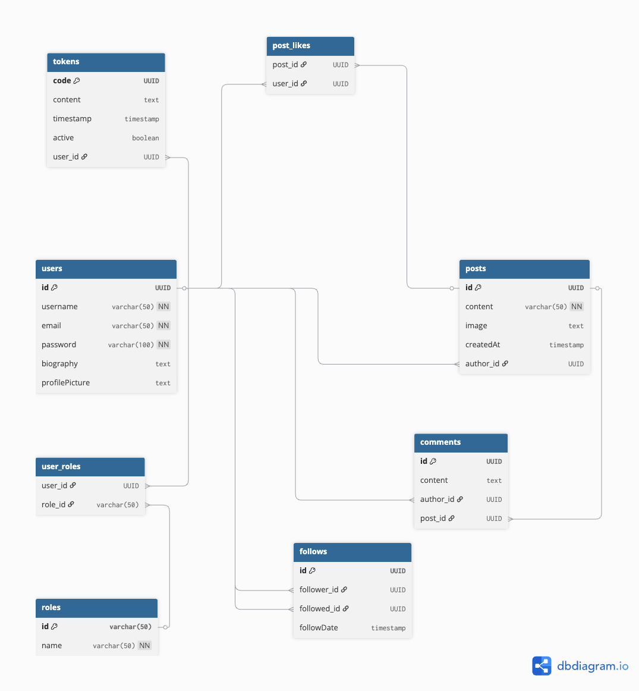

# 🧬 Modelo de Base de Datos - MiniTweet API

La base de datos de **MiniTweet** está diseñada bajo un enfoque **n-tier**, usando una arquitectura relacional con **PostgreSQL** como gestor.

Gracias a JPA (Java Persistence API), las entidades Java se mapean directamente a tablas en la base de datos.

---

## 🗃️ Entidades principales

| Entidad   | Descripción breve |
|-----------|-------------------|
| `User`    | Representa a los usuarios del sistema |
| `Post`    | Publicaciones de los usuarios |
| `Comment` | Comentarios en publicaciones |
| `Follow`  | Relaciones de seguimiento entre usuarios |
| `Role`    | Roles de usuario (ADMIN, USER, etc.) |
| `Token`   | Tokens JWT activos para sesiones |

---

## 🔗 Diagrama de relaciones



> 🧠 Cada relación está optimizada para el rendimiento y el control de acceso, incluyendo protecciones con anotaciones `@JsonIgnore` para evitar ciclos infinitos al serializar.

---

## 📋 Definiciones de entidades clave

### 👤 Usuario (`User`)
- `username`, `email`, `password`
- `roles` (Muchos a Muchos con `Role`)
- `posts` (Uno a Muchos con `Post`)
- `followers` / `following` (Uno a Muchos con `Follow`)
- Implementa `UserDetails` para compatibilidad con Spring Security

### 📝 Post (`Post`)
- `content`, `image`, `createdAt`
- `author` (Muchos a Uno con `User`)
- `likedBy` (Muchos a Muchos con `User`)
- `comments` (Uno a Muchos con `Comment`)

### 💬 Comentario (`Comment`)
- `content`
- `author` (Muchos a Uno con `User`)
- `post` (Muchos a Uno con `Post`)

### 🔁 Seguimiento (`Follow`)
- `follower` y `followed` (ambos ManyToOne con `User`)
- `followDate`

### 🛡️ Rol (`Role`)
- `id`, `name`
- Se relaciona con `User` para autorización

### 🔐 Token (`Token`)
- `code`, `content`, `active`
- Asociado a un `User` autenticado

---

## 🐘 Configuración de PostgreSQL

Para correr PostgreSQL localmente con Docker:

### 🧱 Docker Compose

```yaml
# docker-compose.yml
version: '3.1'

services:
  postgres:
    image: postgres:15
    restart: always
    container_name: minitweet-postgres
    ports:
      - 5432:5432
    environment:
      POSTGRES_USER: postgres
      POSTGRES_PASSWORD: admin
      POSTGRES_DB: minitweet_db
    volumes:
      - pgdata:/var/lib/postgresql/data

volumes:
  pgdata:
```
### 🏃‍♂️ Iniciar el contenedor

```bash
docker-compose up -d
```
La base de datos estará disponible en `localhost:5432` con las credenciales proporcionadas.

---

## ⚙️ Configuración en Spring Boot

Asegúrate de tener las siguientes propiedades en tu archivo `application.properties`:

```properties
spring.datasource.url=jdbc:postgresql://localhost:5432/minitweet_db
spring.datasource.username=postgres
spring.datasource.password=admin
spring.jpa.hibernate.ddl-auto=update
spring.jpa.show-sql=true
```
> Puedes cambiar estos valores según tu entorno o usar variables de entorno con **application.yml** o **application-dev.properties**.

---

## 🧪 Tips de desarrollo
- Usa herramientas como pgAdmin, DBeaver o TablePlus para visualizar tus datos.
- Evita exponer contraseñas o tokens directamente desde las entidades.
- Usa @JsonIgnore o @JsonView para controlar lo que envías en las respuestas.


